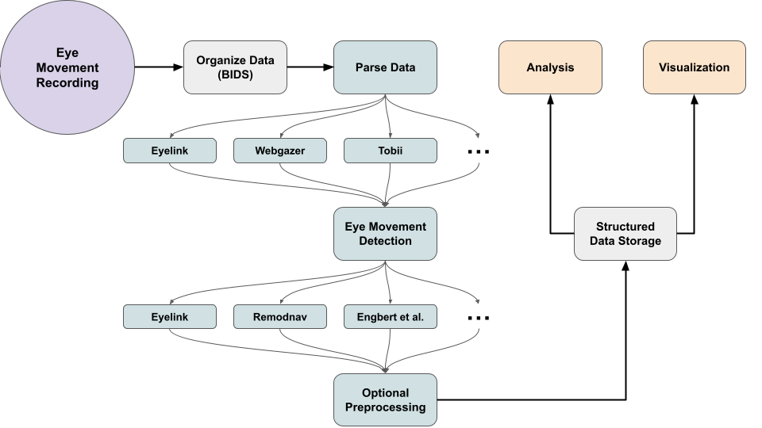

# Summary

Pyxations is a Python-based toolbox designed to unify the organization, parsing, and analysis of eye-movement data. It supports multiple common recording formats and detection algorithms, and offers integrated tools for preprocessing, visualization, and downstream analysis. Pyxations converts sample-level recordings from its supported eye trackers to the eye-tracking physiological format defined by BIDS, writes processed samples and detected eye movements as a linked BIDS Derivatives dataset, and verifies both generated datasets with the official BIDS Validator. By standardizing these steps, Pyxations facilitates reproducibility and makes it easier to compare results across tasks, devices, and studies.

# Statement of Need

Looking at someone’s eyes, searching for your keys or reading, are all active processes in which eye movements take a crucial role [@rayner1998; @wade2005; @land2009looking; @holmqvist2011eye]. These movements include the saccades and fixations, focusing on the most relevant regions of the scene, but also smooth pursuit, microsaccades, or vergence. They are usually measured by optical eye-trackers, which consist of a camera collecting images from the eyes that ultimately provide the position and pupil size of both eyes on the scene. The cameras range from high-speed cameras (up to 2 kHz) to low-cost commercial webcams, and they also differ on the zoom applied and the inclusion of an IR source/filter. Finally, to go from the recording of the eyes’ position to actual eye movements, it is necessary to detect such eye movements, for which there are many algorithms available, such as EyeLink [@srresearch2021eyelink], Engbert and Mergenthaler [@engbert2006microsaccades], REMoDNaV [@dar2021remodnav], among others.

The Brain Imaging Data Structure (BIDS) now specifies how sample-level eye-tracking recordings and their metadata should be represented [@gorgolewski2016bids]. However, converting heterogeneous vendor recordings into this representation and continuing from standardized samples to reproducible preprocessing, event detection, and analysis still requires substantial format-specific orchestration. Differences among experimental paradigms, devices, calibration procedures, and event-detection algorithms make it difficult to move from raw recordings to comparable results. Pyxations addresses this implementation gap while retaining the original vendor files for provenance.

In recent years, several open-source toolboxes have been developed to support eye-tracking data processing, including PyMovements [@krakowczyk2023pymovements], PyTrack [@ghose2020pytrack], and SPEED [@lozzi2025speed]. Each of these offers valuable functionality within the growing ecosystem of open tools for gaze analysis, yet none fully address the combined challenges of dataset heterogeneity, reproducibility, and large-scale workflow automation that Pyxations is designed to solve. Below we summarize their key features and how Pyxations extends or complements them.

PyMovements provides a modular Python interface for parsing, preprocessing, and analyzing eye-tracking data. It supports velocity-based event detection (fixations, saccades), data-quality metrics, and reproducibility guidelines. However, PyMovements is agnostic to data organization and format diversity: it does not enforce or automatically adapt to standardized folder hierarchies (e.g., BIDS-like structures), nor directly support data from multiple tracker vendors or legacy file types.

PyTrack is an end-to-end toolkit featuring fixation, saccade, and microsaccade extraction, estimation of multiple metrics (including pupil and blinks), and visualizations. Its graphical interface and built-in statistical tools make it accessible to non-programmers. Nonetheless, PyTrack is less suited to heterogeneous datasets, as it assumes a relatively uniform input structure. It also provides fewer options for integrating custom detection algorithms or preprocessing modules, making it harder to enforce reproducibility across diverse experimental pipelines.

SPEED (LabSoC Standardized Processing and Extraction of Eye-tracking Data) also focuses on lowering the entry barrier. However, SPEED is tailored to Pupil Labs’ data and lacks flexibility.

Therefore, Pyxations was designed as a reproducible and extensible framework that unifies these complementary strengths while addressing their limitations. It is a Python-based toolbox designed to unify the organization, parsing, and analysis of eye-movement data. It supports multiple common recording formats and detection algorithms, and offers integrated tools for preprocessing, visualization, and downstream analysis. Its conversion layer writes per-eye BIDS physiological recordings and retains vendor originals under `sourcedata`; its processing layer writes a linked BIDS Derivatives dataset containing processed samples and eye-movement annotations, facilitating reproducibility and comparison across tasks, devices, and studies.

# Research Impact Statement

Pyxations has already been deployed to standardize workflows in active research environments. It was utilized to process and analyze webcam-based eye-tracking data for a study on validation of an online antisaccade paradigm [@JuantorenaAntisaccade]. Moreover, source code was also utilized for EyeLink data in a study on hybrid search strategies, which combined Bayesian and neural network models [@ruarte2025integrating].

The library's versatility has been further validated through the successful harmonization of diverse datasets. It has been used to process data from GazePoint 3 trackers, in-house web-based eye-trackers, and driving simulation experiments (courtesy of collaborators mentioned in the acknowledgements), demonstrating its capacity to handle real-world heterogeneity beyond standard laboratory tasks. Furthermore, we are currently collaborating with three additional research groups to integrate Pyxations into their data analysis pipelines, establishing it as a growing standard for reproducible eye-tracking research.

# Software Design

Pyxations is designed as a reproducible and extensible framework that unifies the complementary strengths of previous developments while addressing their limitations. Its core contributions can be summarized (Fig. 1) as follows:

**Standardized dataset organization.** Pyxations writes sample-level eye-tracking data and metadata according to BIDS [@gorgolewski2016bids], including separate physiological recordings for each eye, while retaining original vendor files under `sourcedata`. Processed sample streams and detected fixations, saccades, blinks, and messages are stored in a linked BIDS Derivatives dataset as compressed tabular files with JSON sidecars. Both raw and derivative datasets are checked with the official BIDS Validator in continuous integration. This facilitates transparent sharing, version control, and collaborative reuse.

**Cross-format parsing and harmonization.** It supports multiple native formats (e.g., EyeLink .edf/.asc, Tobii, WebGazer, and text-based legacy files) through a unified parsing API, reducing friction when combining data from different acquisition systems.

**Calibration- and validation-aware preprocessing.** Pyxations directly parses calibration and validation reports (e.g., EyeLink VALIDATION blocks), extracting per-session accuracy, offset, and drift metrics. These can be used for automated exclusion or weighting of low-quality data.

**Flexible trial segmentation.** The framework accommodates multiple trialing paradigms: explicit start and end timestamps, event-based markers, or fixed-duration trials. All of them with overlap controls and regular-expression message matching. This flexibility enables consistent parsing of diverse experimental logics without manual preprocessing.

**Declarative, provenance-aware workflow.** Every preprocessing operation (e.g., interpolation, blink rejection, event detection) is logged automatically in machine-readable JSON recipes and provenance sidecars. This ensures exact reproducibility of analysis pipelines across computing environments.

**Scalability and performance.** Built on the Polars data engine [@vink2022], Pyxations executes parallelized operations on large eye-tracking datasets, significantly outperforming traditional pandas-based workflows [@mckinney2020]. This makes it suitable for multi-subject, multi-session analyses typical in modern cognitive experiments.

**Visualization, statistics, and inspection tools.** In addition to standard gaze plots, Pyxations includes dynamic scanpath visualizations, hierarchical data analysis (experiment, subject, session, trial), per-trial calibration visualization, and task-specific visualization utilities tailored to paradigms such as visual search. Multimatch metrics [@dewhurst2012] are also embedded at the trial level to compare similarity between scanpaths.

**Integration and interoperability.** Pyxations can interface with existing libraries such as PyMovements for event detection [@krakowczyk2023pymovements] or PyTrack for visualization within its standardized processing pipeline [@ghose2020pytrack]. It thus functions not as a replacement but as an orchestration layer that harmonizes and scales the use of existing tools.

# Figure 1

In summary, Pyxations extends current open-source eye-tracking software by offering a scalable, provenance-aware, and calibration-informed framework that unifies parsing, preprocessing, and analysis within a standardized data structure. We want to keep building upon this framework which is why we decided to use design patterns for code scalability.

# AI Usage Disclosure

We utilized generative AI tools (primarily ChatGPT-4o and Gemini 2.5 Flash) to a limited extent, specifically for generating individual methods based on established architectural decisions, creating unit tests, and drafting documentation strings. We did not employ autonomous AI agents or large-scale automated coding pipelines. Regarding the manuscript, these tools were used solely for linguistic refinement, such as typo spotting, grammar correction, and minor stylistic improvements. The core scientific content, figures, and bibliography were not generated by AI.

# Acknowledgements

This project was supported by CONICET and UBA. We thank Pablo Laciana for his contribution to the code and Damián Care, Fermín Travi and Bruno Bianchi for their expert insights and constructive discussions during the preparation of this work. We thank Stephanie Muller and Enzo Tagliazucchi for sharing the GazePoint 3 data. Finally, We express our gratitude to Matias Ison for sharing the Driving data. 

# References
